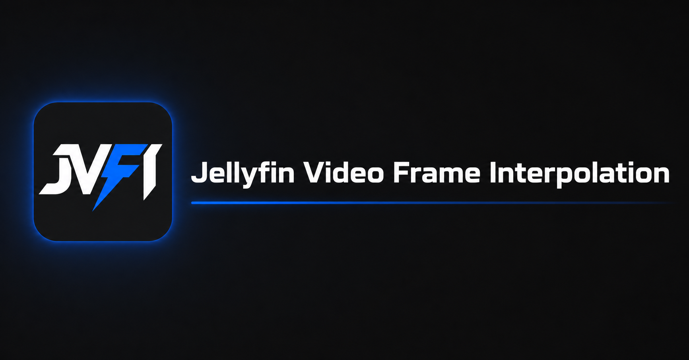

<p align="center"></p>

# JVFI-VAAPI（Jellyfin 即時補幀 · VAAPI 修正版）

**繁體中文** | [简体中文](README.zh-CN.md) | [English](README_EN.md) | [Русский](README.ru.md)

本 repo 為 [SkillGodAk/JVFI](https://github.com/SkillGodAk/JVFI) 的 **VAAPI 修正 fork**（基於 JVFI **0.7.6.0**，針對 **Jellyfin 12.1** 建置）。修正 Jellyfin 12 在 VAAPI 路徑上 `-filter_hw_device vk` 與 `h264_vaapi` + `hwupload` 不相容、導致 FFmpeg **218** 與播放器致命錯誤的問題。

功能與 JVFI 相同：伺服器端即時補幀、可自訂目標幀率；Web / Media Player / Android / TV 用戶端無需另外安裝外掛。

## 安裝

### Jellyfin 擴充庫

進入 `控制台` → `插件` → `儲存庫`，新增：

| 項目 | 內容 |
|------|------|
| 名稱 | `JVFI-VAAPI` |
| 儲存庫網址 | `https://shipa-2.github.io/JVFI-VAAPI/manifest.json` |

回到插件目錄安裝 **JVFI**，**完整重新啟動** Jellyfin。

（需已啟用本 repo 的 GitHub Pages；若 manifest 無法開啟，請改用手動安裝。）

### 手動安裝

從 [GitHub Releases](https://github.com/shipa-2/JVFI-VAAPI/releases) 下載 `jellyfin-video-frame-interpolation_0.7.6.1.zip`（或最新版），解壓到：

```text
jellyfin/config/plugins/Jellyfin Video Frame Interpolation/
```

Docker 範例：

```text
/volume1/docker/jellyfin/config/plugins/Jellyfin Video Frame Interpolation/
```

若曾安裝官方 `JVFI_0.7.6.0` 資料夾，請先移除舊版插件目錄，再解壓新版。**完整重新啟動** Jellyfin。

### 從原始碼建置

```bash
git clone https://github.com/shipa-2/JVFI-VAAPI.git
cd JVFI-VAAPI/src
dotnet publish -c Release -o ../dist
```

將 `dist/` 內所有檔案複製到上述 `plugins/Jellyfin Video Frame Interpolation/`，再完整重啟。

## 使用方式

1. Jellyfin `播放` → 硬體加速：**VAAPI**，裝置 `/dev/dri/renderD128`。
2. `控制台` → `插件` → **JVFI**：啟用補幀、選使用者與媒體庫、**Output encoder** 建議 **Vaapi**、設定目標 FPS。
3. 播放時需進入**轉碼**（非 Direct Play）才會套用 JVFI。

## 支援環境

| 項目 | 狀態 |
|---|---|
| Jellyfin **12.1.x** | 本 fork 主要目標 |
| AMD / Intel **VAAPI**（Linux） | 含 `-filter_hw_device` 修正 |
| 官方 JVFI 其他平台 | 邏輯沿用 0.7.6.0，請自行測試 |

非 Jellyfin 官方產品；上游插件作者 **SkillGodAK**，本 fork 由社群維護。
